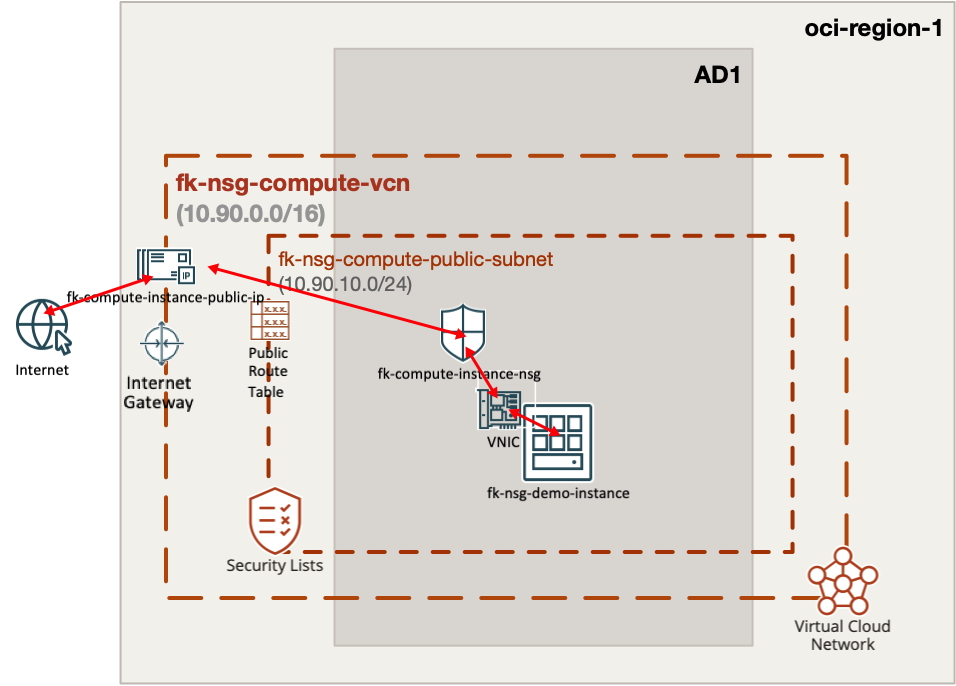
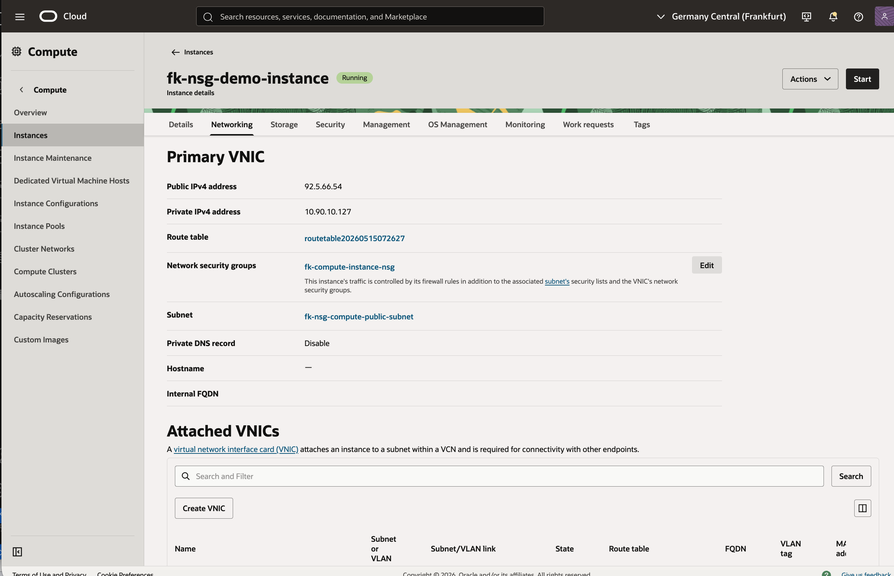
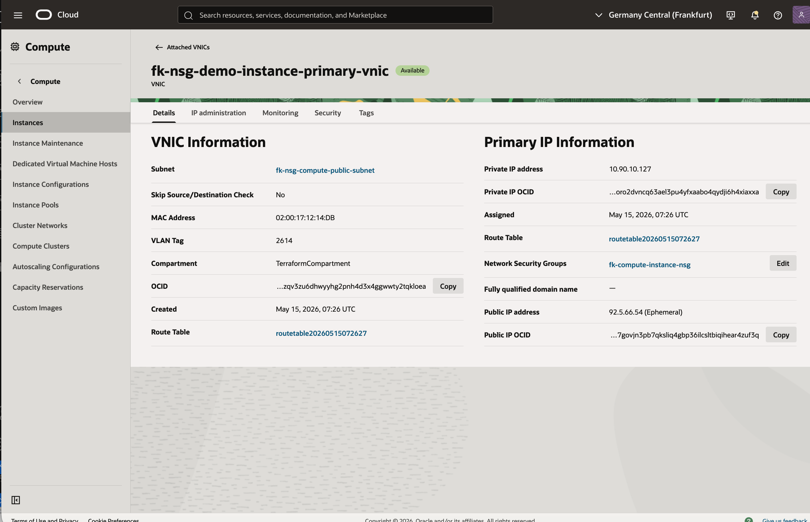
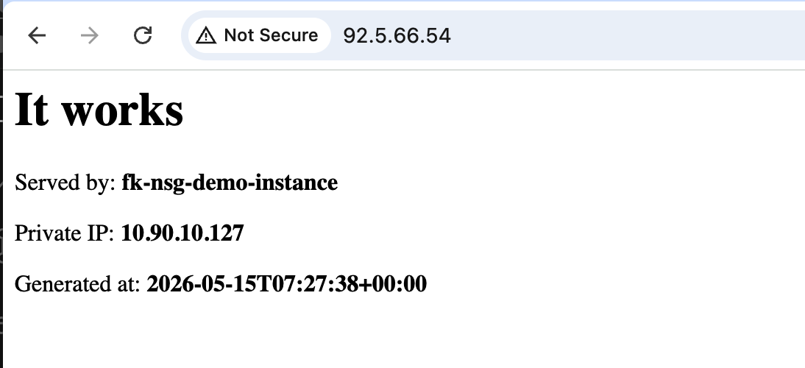

# Example 01: Compute Instance With NSG And Reserved Public IP

In this example, we deploy a **single Oracle Cloud Infrastructure (OCI) compute instance**
with a **VNIC-attached Network Security Group (NSG)** and a **reserved OCI public IP**
using **Terraform/OpenTofu**.
The environment combines:

- `terraform-oci-fk-vcn`
- `terraform-oci-fk-nsg`
- `terraform-oci-fk-compute`
- `terraform-oci-fk-public-ip`

This is the most direct example of using the NSG module as a **workload-scoped security boundary**.

---

## Architecture Overview



This deployment creates:

- A dedicated **VCN** with one **public subnet**
- One **OCI Network Security Group**
- Ingress NSG rules for **SSH** on port `22` and **HTTP** on port `80`
- One **regular OCI compute instance** launched without an auto-assigned public IP
- One **reserved OCI public IP** attached explicitly to the instance primary private IP
- A small **cloud-init bootstrap** that starts a demo HTTP service

Traffic flow:

- Clients connect to the reserved public IP address
- OCI maps that public IP to the instance primary private IP
- The instance VNIC is a member of the NSG created by this module
- The NSG controls which inbound ports are exposed at the workload edge

---

## Deployment Steps

Initialize and apply the Terraform/OpenTofu configuration:

```bash
tofu init
tofu plan
tofu apply
```

If you prefer Terraform:

```bash
terraform init
terraform plan
terraform apply
```

After a successful deployment, Terraform will output:

- The NSG ID
- The instance ID
- The private IP
- The reserved public IP ID
- The reserved public IP address

These outputs make it easy to verify that the instance is reachable
and that both the NSG and public IP were attached to the primary VNIC path.

---

## Runtime Notes

This example keeps the subnet security list intentionally minimal,
places the workload-facing ingress policy in the NSG,
and models public reachability as a separate OCI networking resource.

The compute instance should:

- have a reserved public IP attached to its primary private IP
- allow SSH on port `22`
- expose a simple HTTP page on port `80`

---

## OCI Console And Runtime Verification

### Instance Status



This view confirms that the compute instance is deployed successfully
and is running with the expected primary VNIC.

### Primary VNIC And NSG Attachment



This view confirms that:

- the instance primary VNIC is attached to the expected subnet
- the NSG created by this example is associated with the VNIC
- the private addressing path used for the reserved public IP handoff is correct

### HTTP Access



This runtime verification confirms that:

- the reserved public IP is reachable from the internet
- the NSG allows HTTP traffic on port `80`
- the demo page returns hostname, private IP, and generation timestamp

---

## Cleanup

To remove all resources created by this example:

```bash
tofu destroy
```

Or with Terraform:

```bash
terraform destroy
```

---

## Summary

This example demonstrates:

- how to create an **OCI NSG**
- how to attach it to a **compute primary VNIC**
- how to attach a **reserved OCI public IP** using `terraform-oci-fk-public-ip`
- how to define explicit **ingress and egress rules**
- how to combine the NSG module with `terraform-oci-fk-vcn`, `terraform-oci-fk-compute`, and `terraform-oci-fk-public-ip`

---

## Learn More

Visit [FoggyKitchen.com](https://foggykitchen.com/) for OCI, multicloud, and Terraform/OpenTofu learning resources.

---

## License

Licensed under the **Universal Permissive License (UPL), Version 1.0**.
See [LICENSE](../../LICENSE) for more details.
