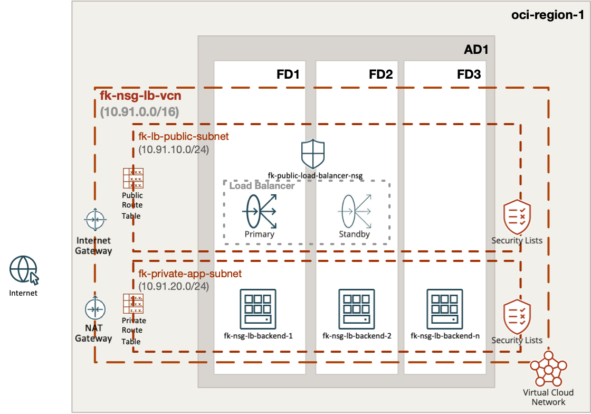
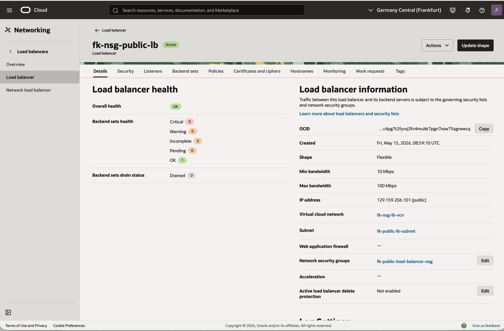
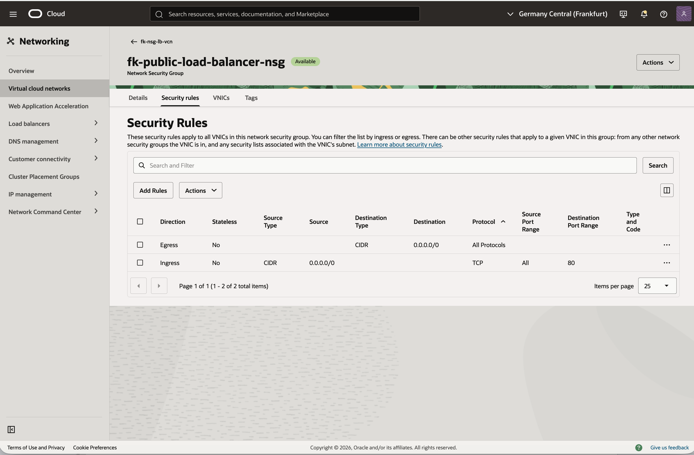
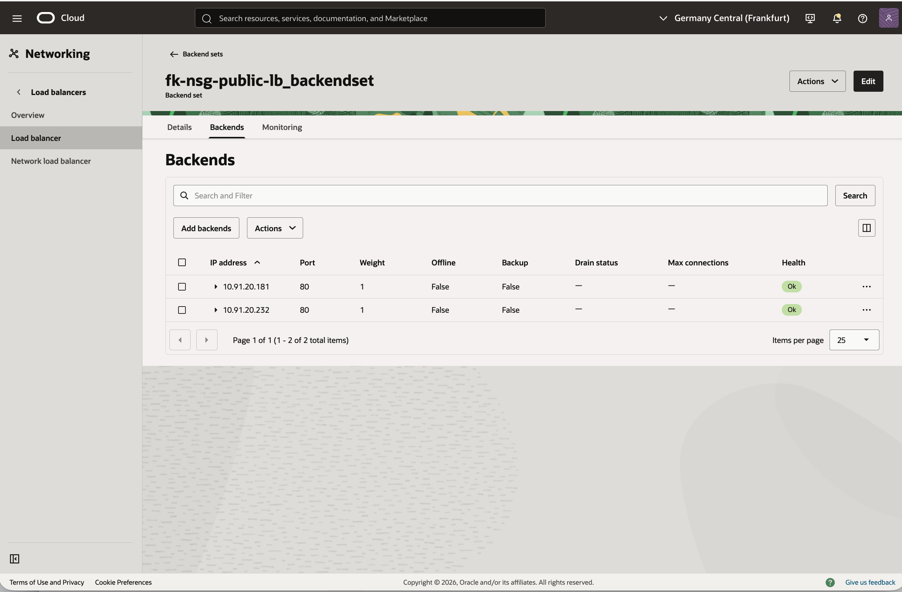
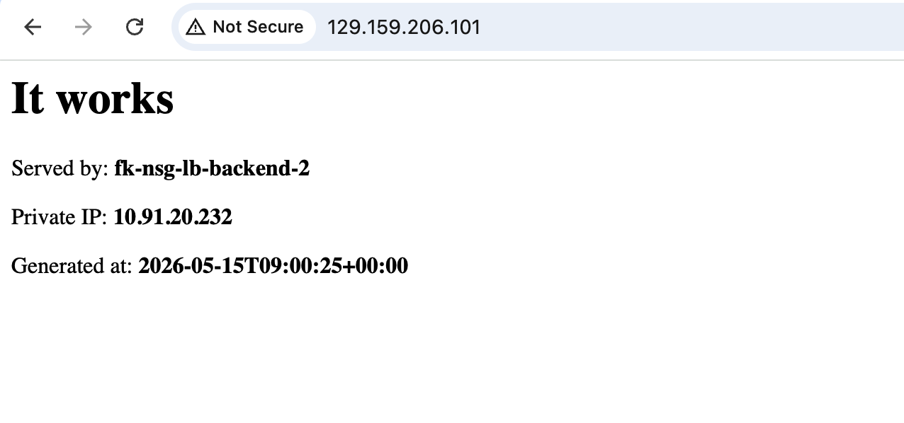

# Example 02: Load Balancer With NSG

In this example, we deploy a **public Oracle Cloud Infrastructure (OCI) Load Balancer**
with a **dedicated frontend Network Security Group (NSG)** using **Terraform/OpenTofu**.
The environment combines:

- `terraform-oci-fk-vcn`
- `terraform-oci-fk-nsg`
- `terraform-oci-fk-loadbalancer`
- `terraform-oci-fk-compute`

This example mirrors a common tiered pattern:
the load balancer is exposed publicly,
while backend instances remain private in a separate subnet.

---

## Architecture Overview



This deployment creates:

- A dedicated **VCN**
- One **public subnet** for the load balancer
- One **private subnet** for the backend instances
- One **OCI Network Security Group** attached to the load balancer
- One **public OCI Load Balancer**
- `instance_count` regular backend compute instances
- One backend set populated from backend private IPs

Traffic flow:

- Clients connect to the public IP of the OCI Load Balancer
- The load balancer frontend is protected by the NSG created by this module
- The load balancer forwards HTTP traffic to private backend instances on port `80`
- Backend instances remain private and are not exposed directly to the internet

---

## Deployment Steps

Initialize and apply the Terraform/OpenTofu configuration:

```bash
tofu init
tofu plan
tofu apply
```

If you prefer Terraform:

```bash
terraform init
terraform plan
terraform apply
```

To scale the number of backend instances, set `instance_count` to `2` or more,
for example in `terraform.tfvars`:

```hcl
instance_count = 3
```

After a successful deployment, Terraform will output:

- The NSG ID
- The load balancer ID
- The load balancer public IPs
- The backend instance private IPs

---

## Runtime Notes

This example places internet-facing HTTP policy on the load balancer NSG
and keeps backend instances in a private subnet.

The result is a clean separation between:

- frontend exposure handled by the load balancer and its NSG
- backend workload placement handled by the compute module
- network topology handled by the VCN module

---

## OCI Console And Runtime Verification

### Load Balancer Status



This view confirms that the public OCI Load Balancer is deployed successfully
and exposed through a public frontend IP.

### NSG Security Rules



This view confirms that the frontend NSG:

- allows inbound HTTP traffic on port `80`
- keeps the internet-facing access policy explicit and isolated from backend instances
- remains attached to the load balancer security boundary modeled by this example

### Backend Health



This view confirms that:

- backend instances are registered successfully in the backend set
- health checks report the backends as healthy
- private backend nodes are ready to receive traffic from the load balancer

### HTTP Access Through The Load Balancer



This runtime verification confirms that:

- the public load balancer is reachable from the internet
- traffic is forwarded to healthy private backend instances
- the demo page returns hostname, private IP, and generation timestamp from the responding backend

---

## Cleanup

To remove all resources created by this example:

```bash
tofu destroy
```

Or with Terraform:

```bash
terraform destroy
```

---

## Summary

This example demonstrates:

- how to create an **OCI NSG** for a load balancer frontend
- how to attach that NSG through `network_security_group_ids`
- how to keep backend instances private behind a public load balancer
- how to compose the NSG module with VCN, Compute, and Load Balancer modules

---

## Learn More

Visit [FoggyKitchen.com](https://foggykitchen.com/) for OCI, multicloud, and Terraform/OpenTofu learning resources.

---

## License

Licensed under the **Universal Permissive License (UPL), Version 1.0**.
See [LICENSE](../../LICENSE) for more details.
